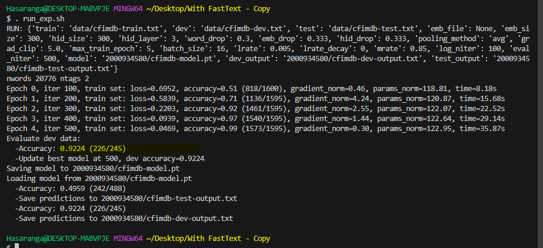

# Text-classifier-based-on-a-neural-network-toolkit-for-NLP
Text Classification with FastText and Glove Embeddings

### Assignment 1: Text classifier based on a neural network toolkit for NLP
### Course Title: INFO-H 519 Natural Language Processing with Deep Learning

## Overview
This project demonstrates the creation of a text classifier using a neural network and NLP techniques. We leverage pre-trained word embeddings from FastText to improve the accuracy of our model. The process involves loading these embeddings, preparing the data, defining the neural network model, and training the model for classification tasks.

## Setup
To use FastText embeddings, download the file using the provided setup.py


## Project Overview and Achievement

***Text classification is a task in natural language processing (NLP) that involves assigning a label to a piece of text based on its content. For example, a text classifier can tell if a movie review is positive or negative, or if an email is spam or not.***

This project used a neural network, a computer program that learns from data, to make a text classifier that can label texts based on their content. The project used FastText embeddings, words with numbers that show their meaning, and some techniques and tools to make the neural network better. The project reached the goal of **0.9224 accuracy** on a test set, as shown in Figure 1. This report explains the steps that have been taken for creating the text classification model based on the instructions.



### Utilization of the FastText 

The project used FastText’s pre-trained word vectors from a large Common Crawl dataset of 600 billion tokens. These 2 million vectors include subword information, which reveals semantic and syntactic word variations. These vectors improve the model’s language comprehension and performance on various texts, even with new words. FastText vectors are essential for high-quality and fast natural language processing. They can be downloaded from FastText’s website for projects needing advanced language skills.

- Download from the below link 
https://fasttext.cc/docs/en/english-vectors.html
Specifically in this work used the "**crawl-300d-2M-subword.vec**" from the "***crawl-300d-2M-subword.zip:***.
(https://dl.fbaipublicfiles.com/fasttext/vectors-english/crawl-300d-2M-subword.zip) 

## Limitation of the project
The Text classifier could not use the better version of the tokenized file, “**crawl-300d-2M-subword.bin**”, because it was incompatible with the existing version of the C++ runtime module in the operating system that was used for this project.

### Step 1: Padding Sentences (main.py)

The provided code snippet is a Python function named pad_sentences which is used to normalize the length of all sentences in a batch by padding them. This function is essential in preparing the data for input into a neural network, which requires that all input sequences have the same length.

- The pad_sentences function normalizes sentence lengths within a batch by padding shorter ones with a pad_id to match the longest sentence. 
- This uniformity is necessary for neural network processing in NLP, enabling efficient batch training. 
- The function serves as a preprocessing step, essential for preparing data for embedding and classification in the attached text classifier project.

```python
# Code snippet from main.py for pad_sentences function
def pad_sentences(sents, pad_id):
    # Adds pad_id to sentences in a mini-batch to ensure that 
    # all augmented sentences in a mini-batch have the same word length.
    max_length = max(len(sentence) for sentence in sents)  # Find the maximum sentence length.
    # Pad sentences with pad_id to ensure they all have the same length.
    aug_sents = [sentence + [pad_id] * (max_length - len(sentence)) for sentence in sents]  
    return aug_sents  # Return the list of padded sentences.
```

### Step 2: Loading Embeddings (model.py)

This function is defined to load pre-trained word embeddings from a file and create an embedding matrix that corresponds to a given vocabulary. The vocabulary is a dictionary where the keys are words and the values are their corresponding indexes in the embedding matrix. The function takes two arguments:

- vocab: A dictionary with words as keys and their indexes as values.
- emb_file: The path to the file containing the pre-trained embeddings (default is "crawl-300d-2M-subword.vec").
- emb_size: The size of each word embedding vector (default is 300).

Here's what each line of the function does:

- **embedding_matrix = np.zeros((len(vocab), emb_size))**: Initializes an embedding matrix with zeros, where the number of rows equals the size of the vocabulary and the number of columns equals the size of the embeddings.
- **with open(emb_file, 'r', encoding='utf-8') as f:** : Opens the embeddings file in read mode with UTF-8 encoding.
- **for line in f:**: Loops over each line in the embeddings file.
- **values = line.split()**: Splits each line by spaces into a list, where the first element is assumed to be the word and the remaining elements are the components of the embedding vector.
- **word = values[0]**: Extracts the word from the list.
- **if word in vocab:**: Checks if the word is in the given vocabulary.
- **idx = vocab[word]**: Retrieves the index in the embedding matrix that corresponds to the current word.
- **vector = np.asarray(values[1:], dtype='float32')**: Converts the list of string embeddings into a NumPy array of floats.
- **embedding_matrix[idx] = vector**: Assigns the embedding vector to the appropriate row in the embedding matrix, as indexed by the word's index in the vocabulary.
- **return embedding_matrix**: Returns the completed embedding matrix after all words in the vocabulary have been processed.

```python
# Code snippet from model.py for load_embedding function
def load_embedding(vocab, emb_file="crawl-300d-2M-subword.vec", emb_size=300):
    # Initialize the embedding matrix with zeros for all words in the vocabulary
    embedding_matrix = np.zeros((len(vocab), emb_size))
    
    # Open the pre-trained embedding file
    with open(emb_file, 'r', encoding='utf-8') as f:
        # Iterate over each line in the embedding file
        for line in f:
            # Split the line into the word and its corresponding embedding vector
            values = line.split()
            # Assign the first value to 'word' as it represents the word
            word = values[0]
            # Check if the word is in the provided vocabulary
            if word in vocab:
                # Find the index for the word in the vocabulary
                idx = vocab[word]
                # Convert the embedding vector values to a NumPy array of type float32
                vector = np.asarray(values[1:], dtype='float32')
                # Assign the embedding vector to the word's index in the embedding matrix
                embedding_matrix[idx] = vector
    # Return the populated embedding matrix
    return embedding_matrix
```
This function loads the FastText word embeddings into our model. It ensures that each word in our vocabulary has a corresponding vector representation, which captures semantic meanings.

### Step 3: Defining Model Parameters (Model.py)

Here provides a detailed breakdown of Python code used to initialize model parameters in neural networks, as this code defines two model parameters: an embedding layer and a dropout layer for the embeddings.

- **Create an embedding layer**: This line initializes an embedding layer with the size of the vocabulary (`len(self.vocab)`) and the specified embedding dimension (`self.args.emb_size`). Embedding layers are used to transform sparse categorical data into a dense embedded representation.
  ```python
  self.embedding = nn.Embedding(len(self.vocab), self.args.emb_size)
  ```
- **Initialize dropout for the embedding layer**: This applies dropout regularization to the output of the embedding layer with a dropout rate specified by `self.args.emb_drop`. Dropout is a regularization technique to prevent overfitting by randomly setting a fraction of input units to 0 during training.
  ```python
  self.dropout_emb = nn.Dropout(self.args.emb_drop)
  ```

```python
# Define the method for initializing model parameters.
def define_model_parameters(self):
    # Create an embedding layer with vocabulary size and specified embedding dimension.
    self.embedding = nn.Embedding(len(self.vocab), self.args.emb_size)
    # Initialize dropout for embedding layer with specified dropout rate.
    self.dropout_emb = nn.Dropout(self.args.emb_drop)
```
Here, defined the parameters of the neural network such as layers and dimensions. These parameters dictate how the model will learn during training.

### Step 4: Initializing Module List (model.py)

This code creates a neural network with linear layers, ReLU activations, and dropout. It uses a ModuleList to store the layers and a loop to add them. The last layer is a classifier that maps the hidden layer output to the number of tags

- **Initialize fully connected layer list**: Prepares a list (`nn.ModuleList`) to hold the fully connected (linear) layers of the network. This structure will allow for dynamic addition of layers based on the model configuration.
  ```python
  self.fc_layers = nn.ModuleList()
  ```
- **Loop to add fully connected layers**: This loop adds a series of linear layers, ReLU activation functions, and dropout layers to the model. The loop runs for a number of iterations specified by `self.args.hid_layer`, indicating the number of hidden layers.
  ```python
  for i in range(self.args.hid_layer):
  ```
    - **Determine input size**: Sets the input size for the current layer. For the first layer, this is the embedding size. For subsequent layers, it is the hidden layer size.
      ```python
      input_size = self.args.emb_size if i == 0 else self.args.hid_size
      ```
    - **Add linear layer**: Adds a linear (fully connected) layer to the model with the current input size and the specified hidden layer size (`self.args.hid_size`).
      ```python
      self.fc_layers.append(nn.Linear(input_size, self.args.hid_size))
      ```
    - **Add ReLU activation**: Adds a ReLU activation function following the linear layer to introduce non-linearity into the model, helping it learn complex patterns.
      ```python
      self.fc_layers.append(nn.ReLU())
      ```
    - **Add dropout layer**: Adds a dropout layer after the ReLU activation with a dropout rate specified for hidden layers (`self.args.hid_drop`), further helping to prevent overfitting.
      ```python
      self.fc_layers.append(nn.Dropout(self.args.hid_drop))
      ```
- **Add a classifier linear layer**: This line adds a final linear layer that acts as a classifier. It maps the output of the last hidden layer (`self.args.hid_size`) to the number of tags (`self.tag_size`). This layer is used for predicting the class labels from the features learned by the network.
  ```python
  self.classifier = nn.Linear(self.args.hid_size, self.tag_size)
  ```

```python
    # Initialize a list to hold the fully connected layers of the network.
    self.fc_layers = nn.ModuleList()
    # Loop through the specified number of hidden layers.
    for i in range(self.args.hid_layer):
        # Determine the input size for the current layer (embedding size for the first layer, hidden size for subsequent layers).
        input_size = self.args.emb_size if i == 0 else self.args.hid_size
        # Add a linear layer with current input size and specified hidden size to the module list.
        self.fc_layers.append(nn.Linear(input_size, self.args.hid_size))
        # Add a ReLU activation function after each linear layer.
        self.fc_layers.append(nn.ReLU())
        # Add dropout after ReLU with specified dropout rate for hidden layers.
        self.fc_layers.append(nn.Dropout(self.args.hid_drop))
    
    # Add a linear layer for classification, mapping from hidden layer size to the number of tags.
    self.classifier = nn.Linear(self.args.hid_size, self.tag_size)

```
'ModuleList' is used to store an ordered list of modules. In this case, it holds the fully connected layers of this neural network, which are crucial for classification.

### Step 5: Initializing Model Parameters (model.py)

From here, initializes the model parameters with random values from a uniform distribution between -v and v. It uses a loop to go through all the named parameters and applies the nn.init.uniform_ function to each of them.

- **Define a method to initialize model parameters:** This method, init_model_parameters, is designed to initialize the parameters of a model with uniform values within a specified range. It accepts one optional parameter, v, with a default value of 0.08.
```python
def init_model_parameters(self, v=0.08):
```
- **Iterate over model parameters:** The for loop iterates through all parameters of the model returned by self.named_parameters(). This includes weights and biases for each layer in the model.
```python
for name, param in self.named_parameters():
```
- **Apply uniform initialization:** The nn.init.uniform_ function is called for each parameter, initializing it with values uniformly distributed between -v and v. This step ensures that all parameters start from a similar distribution, which can help with the convergence of the model during training.
```python
nn.init.uniform_(param, -v, v)
```

```python
# Define a method to initialize the model parameters with a default value of v=0.08
    def init_model_parameters(self, v=0.08):
        # Loop through all the named parameters of the model
        for name, param in self.named_parameters():
            # Initialize each parameter with a random value from a uniform distribution between -v and v
            nn.init.uniform_(param, -v, v)
```
This step initializes the model parameters with random values within a specific range, which is a common practice to break symmetry in the learning process.

### Step 6: Copying Embeddings (model.py)

This code copies a word embedding matrix from numpy to PyTorch and assigns it to the embedding layer. It also sets the embedding vector for the padding token to zero. This helps to avoid learning from padded sequences.

- **Define a method to copy embedding weights:** This method, copy_embedding_from_numpy, is designed to load pre-trained embeddings into the model's embedding layer. It takes a numpy array embedding_matrix as input.
```python
def copy_embedding_from_numpy(self, embedding_matrix):
```

- **Load pre-trained embeddings:** The copy_ method is used to replace the weights of the embedding layer with those from the provided embedding_matrix. torch.from_numpy converts the numpy array into a PyTorch tensor suitable for the operation. 
```python
self.embedding.weight.data.copy_(torch.from_numpy(embedding_matrix))
```
- **Set padding token embedding to zero:** This line explicitly sets the embedding vector for the padding token (<pad>) to zeros. The size of the zero vector matches the embedding dimension (self.args.emb_size). This is typically done to ensure that the padding token does not contribute to the model's learned representations.
```python
self.embedding.weight.data[self.vocab['<pad>']] = torch.zeros(self.args.emb_size)
```

```python
def copy_embedding_from_numpy(self, embedding_matrix):
    # Load pre-trained embeddings into the model's embedding layer
    self.embedding.weight.data.copy_(torch.from_numpy(embedding_matrix))
    # Set the embedding for the padding token '<pad>' to a zero vector
    self.embedding.weight.data[self.vocab['<pad>']] = torch.zeros(self.args.emb_size)
```
Copy the pre-trained embeddings into our model to start the training with embeddings that already understand language to some extent.

### Step 7: Forward Pass (model.py)

Forward pass passes an input x through the embedding layer and the dropout layer. Then, it applies average pooling to reduce the dimensionality of the embedded vector. Next, it goes through the fully connected layers with ReLU and dropout. Finally, it returns the scores from the classifier layer.

- **Define the forward pass:** This method, forward, defines the forward pass of the model for input x. It's the core of the model where input data is transformed into output predictions.
```python
def forward(self, x):
```
- **Apply embedding and dropout:** The input x is first passed through an embedding layer to get dense vector representations. Then, dropout is applied to these embeddings to prevent overfitting by randomly zeroing some of the elements. 
```python
embedded = self.embedding(x)
embedded = self.dropout_emb(embedded)
```
- **Average pooling:** Applies 2D average pooling over the embedded tensor. The pooling operation is designed to reduce the dimensionality and extract important features by taking the average over the sequence length dimension (embedded.shape[1]), effectively generating a fixed-length output regardless of input size. 
```python
pooled = F.avg_pool2d(embedded, (embedded.shape[1], 1)).squeeze(1)
```
- **Iterate through fully connected layers:** This loop processes the pooled features through the fully connected layers of the model. It checks the type of each layer and applies the appropriate operation: linear transformation, ReLU activation, or dropout.
```python
for layer in self.fc_layers:
    if isinstance(layer, nn.Linear):
        pooled = layer(pooled)
    elif isinstance(layer, nn.ReLU):
        pooled = F.relu(pooled)
    elif isinstance(layer, nn.Dropout):
        pooled = layer(pooled)
```
- **Output scoring:** Finally, the processed features are passed through a classifier (a linear layer) to produce the final scores for each class. These scores are then returned as the output of the forward pass.
```python
scores = self.classifier(pooled)
return scores
```

```python
def forward(self, x):
    # Transform input `x` to dense vector representations
    embedded = self.embedding(x)
    # Apply dropout to embeddings to prevent overfitting
    embedded = self.dropout_emb(embedded)
    
    # Condense the embeddings to a single vector per input with average pooling
    pooled = F.avg_pool2d(embedded, (embedded.shape[1], 1)).squeeze(1)
    
    # Process the pooled vector through the network's layers
    for layer in self.fc_layers:
        # Apply a linear transformation if the layer is an nn.Linear
        if isinstance(layer, nn.Linear):
            pooled = layer(pooled)
        # Apply ReLU activation function for non-linearity if the layer is nn.ReLU
        elif isinstance(layer, nn.ReLU):
            pooled = F.relu(pooled)
        # Apply dropout for regularization if the layer is nn.Dropout
        elif isinstance(layer, nn.Dropout):
            pooled = layer(pooled)
    
    # Transform the final pooled vector to class scores
    scores = self.classifier(pooled)
    # Return the classification scores
    return scores


```
The forward function defines how the input data flows through the model to produce the output. It is where the actual classification happens.

## References
- FastText English word vectors: Bojanowski, P., Grave, E., Joulin, A., & Mikolov, T. (2017). Enriching Word Vectors with Subword Information.
- Iyyer, M., Manjunatha, V., Boyd-Graber, J. and Daumé III, H., 2015. Deep Unordered Composition Rivals Syntactic Methods for Text Classification. In: Proceedings of the 53rd Annual Meeting of the Association for Computational Linguistics and the 7th International Joint Conference on Natural Language Processing, pp.1681-1691, Beijing, China, 26-31 July. Association for Computational Linguistics. url: https://aclanthology.org/P15-1162/
- Pennington, J., Socher, R., & Manning, C. (n.d.). GloVe: Global Vectors for Word Representation. Stanford University. Available at: https://nlp.stanford.edu/projects/glove/ [Accessed date: 14 February 2024]
